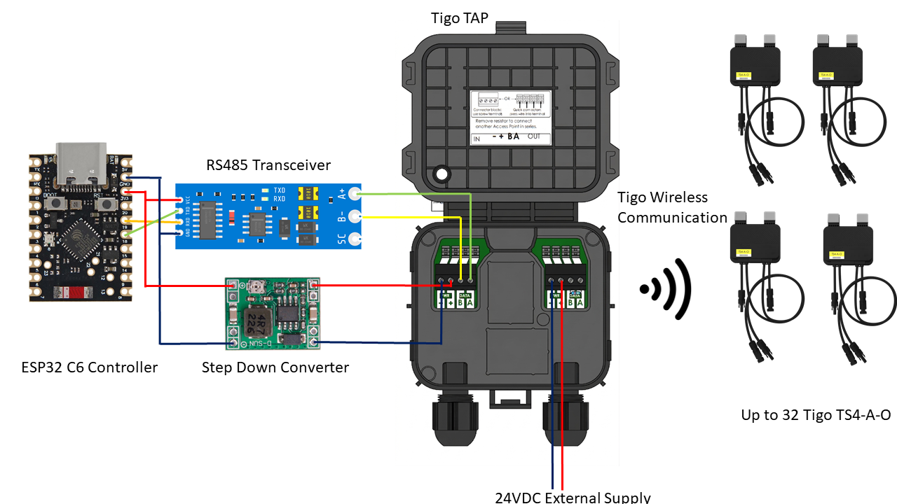

<p align="center">
  
</p>

<h1 align="center">openTAPtoX</h1>

<p align="center">
  <strong>Local monitoring for Tigo TAP and TS4 optimizers with an ESP32, MQTT and Home Assistant.</strong>
</p>

> Unofficial community project. It is not affiliated with or endorsed by Tigo.

`openTAPtoX` replaces the Tigo CCA on the TAP-side RS485 connection. The TAP continues to operate the radio network to the optimizers; the ESP reads the TAP locally, provides a small web UI, and publishes status and telemetry to MQTT.

It supports an `ESP32-C6` and an `ESP32-C3`. The C6 is the preferred choice for a new installation because it has more room for future features. The C3 is a tested, space-saving alternative.

## Before You Start

- This is for local monitoring of a TAP that is already installed or fresh hardware out of the box. The teaching process can be triggered by openTAPtoX.
- Use a proper RS485 transceiver and a regulated DC/DC converter. Do **not** connect the TAP's RS485 wires or 24 V supply directly to ESP GPIO pins.
- Work on the PV/TAP wiring only when it is safe to do so. The project does not replace applicable electrical-safety practice.
- Normal operation does not need a Tigo CCA. Advanced optimizer commissioning and RF recovery are still experimental; leave the advanced recovery controls alone unless you are deliberately diagnosing a system.

## What You Need

- ESP32-C6 Super Mini or ESP32-C3
- 3.3 V automatic-direction TTL-to-RS485 transceiver
- 24 V to 5 V DC/DC converter for the ESP
- TAP RS485 connection with a common ground
- WiFi network; an MQTT broker is optional but recommended for Home Assistant

## Wiring

| Connection | ESP32-C6 | ESP32-C3 |
| --- | --- | --- |
| RS485 RXD | GPIO20 | GPIO6 |
| RS485 TXD | GPIO19 | GPIO5 |
| RS485 VCC | 3V3 | 3V3 |
| RS485 GND | GND | GND |

Connect RS485 `A` to TAP `A`, RS485 `B` to TAP `B`, and connect the TAP ground, RS485 ground, and ESP ground together. Power the ESP through the DC/DC converter, not from the TAP directly.

For the complete C6 wiring diagram, see [ESP32-C6 RS485 and power wiring](docs/hardware/ESP32-C6_RS485_power_wiring.md).

<p align="center">
  
</p>

## Quick Start

1. Clone the repository and create `firmware/openTAPtoX_esp32c6/secrets.h` from `secrets.example.h`. Enter WiFi credentials and, if used, your MQTT broker. `secrets.h` stays local and must not be committed.
2. Wire the ESP, transceiver, TAP bus, and power supply as above. Start with the CCA disconnected.
3. Flash once over USB. From the repository root, build with the matching board target:

   ```powershell
   arduino-cli compile --libraries "$PWD/firmware/common" --fqbn esp32:esp32:esp32c6 firmware/openTAPtoX_esp32c6
   # Or: esp32:esp32:esp32c3
   ```

   Then upload with the matching serial port, for example:

   ```powershell
   arduino-cli upload --fqbn esp32:esp32:esp32c6 --port COM8 firmware/openTAPtoX_esp32c6
   ```

4. Open `http://opentaptox-esp32c6.local` or `http://opentaptox-esp32c3.local`. If mDNS is unavailable, use the IP address from your router's DHCP client list. On WiFi failure, the fallback network is `openTAPtoX-setup` with password `opentaptox`.
5. In the web UI, follow the single `?` guide beside **Start**: wait for a green TAP connection, configure MQTT if wanted, enable polling, refresh the node table, and map detected optimizers to `A1`, `A2`, and so on.
6. If the TAP and node table are healthy but the optimizer string remains near its low RSD voltage, use **Release optimizers (RSD run)** once. The verified command is `0x0B00 01`; allow 60 to 90 seconds for inverter startup.
7. Leave the controller running. Live power appears when the TAP receives optimizer reports; it is normal to see no power after sunset.

## Web Interface

The start area shows the connection, polling, optimizer-discovery, and live-data state at a glance. The `?` beside **Start** contains the normal setup order.

## MQTT And Home Assistant

MQTT is configured in the web UI or in `secrets.h`. Each board has a separate default base topic so multiple controllers can share one broker:

- C6: `openTAPtoX/esp32c6`
- C3: `openTAPtoX/esp32c3`

Below that base, the important paths are:

- `status/esp/...`: controller identity, network, MQTT, firmware, and polling state
- `status/tap/...`: TAP identity, version, connection freshness, and RS485 diagnostics
- `status/nodes/...`: optimizers actually discovered by the TAP
- `status/power/...`: plant-wide totals and sample freshness
- `telemetry/A1/...`: measurements for each panel label

Home Assistant MQTT discovery is published automatically. Do not use the same MQTT base topic for two controllers.

## Troubleshooting

**The page says "No TAP response"**

Check the common ground first, then RS485 `A/B`, transceiver power, and that polling is enabled. The TAP bus is 38400 baud. A TAP power cycle can help after a wiring change.

**The TAP is green but no optimizer power arrives**

The ESP can reach the TAP while the TAP has no live RF reports. Check daylight, the optimizer/node count, and panel mapping. If the node state is plausible but the inverter string remains at low RSD voltage, use **Release optimizers (RSD run)** once and wait 60 to 90 seconds. Do not interpret a TAP acknowledgement as proof that an optimizer received an RF command or that the string voltage rose.

**The `.local` address does not open**

Use the DHCP IP address directly and make a DHCP reservation. mDNS depends on the local network and operating-system resolver.

## Project Layout

- `firmware/openTAPtoX_esp32c6/`: one firmware source tree for C6 and C3 builds
- `firmware/common/`: shared protocol, web UI, MQTT, and persistence code
- `docs/hardware/`: wiring and hardware notes
- `tools/`: validation and analysis helpers

For a quick regression build, run `bash tools/check_repo.sh` on a system with `bash` and `arduino-cli` installed.

## Privacy

Keep captures, telemetry exports, generated analysis, live-device screenshots, credentials, and real device identifiers out of Git. These artifacts can reveal network topology, RF material, household activity, and hardware serial numbers even when they do not contain a person's name. The repository ignores the usual local output locations and validates the tracked tree in CI. See [PRIVACY.md](PRIVACY.md) before sharing diagnostics.

## Further Reading

- [Detailed TAP protocol reconstruction and open questions (German)](docs/TAP_PROTOCOL_RECONSTRUCTION_DE.md)
- [Firmware build notes](firmware/openTAPtoX_esp32c6/README.md)
- [Privacy and safe diagnostic sharing](PRIVACY.md)

## License

Licensed under the [MIT License](LICENSE).
